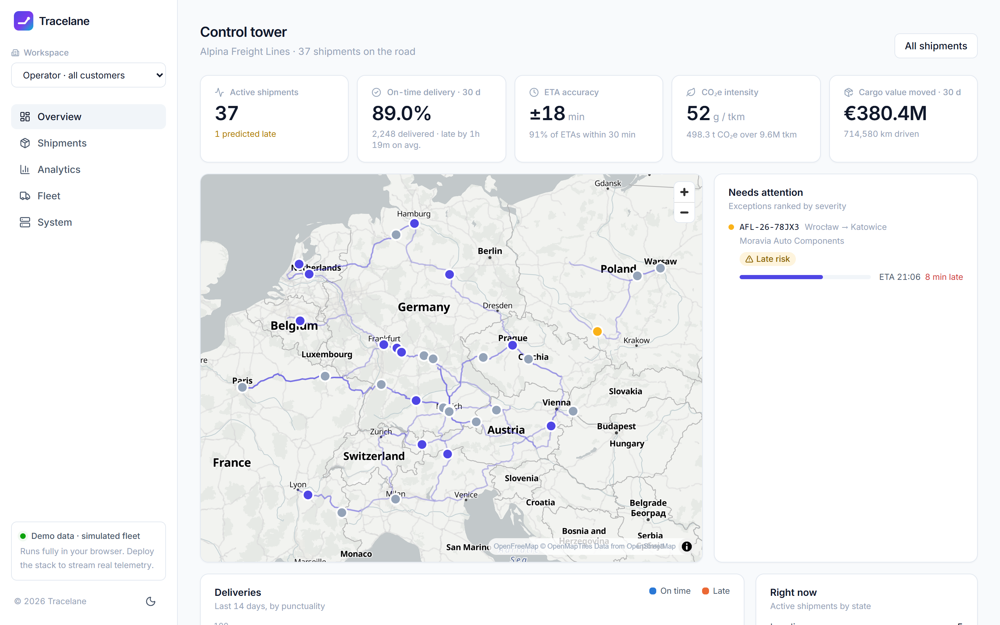

# Tracelane — Serverless Real-Time Freight Visibility

A serverless AWS pipeline that tracks trucks in real time and predicts arrival times using the operating
rules of European road freight, evaluated on a fleet simulator built on real road geometry.
David Fellner · TU Wien × AWS · 2026 · **[Technical report (PDF)](report/report.pdf)**



## Key results

From `evaluation/run_experiments.py` (5 seeds × 30 simulated days, 11,139 deliveries):

| | Result |
|---|---|
| **ETA prediction** | Mean error at 10 % of the route: **27 min** with driving-time rules vs. **220 min** for distance ÷ speed (8×); 85 % vs. 46 % within 30 min |
| **Correctness under faults** | With 20 % duplicates, 2 % malformed messages and reordering, **302 / 302** shipments reach the identical final state; all malformed messages go to the dead-letter queue |
| **Bugs found by the evaluation** | An inconsistency in the ETA predictor's driving-hours logic and an order-dependent metric, both fixed (report §4.1, §4.3) |
| **Planning policy** | On-time rate ranges from 48 % to 98 % depending on the dispatcher's buffers, traded against idle time |
| **Throughput** | Measured 1.76 KB messages → about 17,000 trucks per Kinesis shard at 30 s reporting |

The data is synthetic: the predictor shares the simulator's rules, so ETA accuracy is an upper bound, not real-world accuracy (report §5).

## Run it

**Demo (no AWS, Node.js 18+):**
```bash
cd dashboard && npm install && npm run dev      # http://localhost:3000  (add /app?speed=30 to fast-forward)
```

**Reproduce the results and the report (Python 3.11+):**
```bash
pip install -r requirements-dev.txt
python -m pytest tests -q                        # Lambda, simulator and infrastructure tests
python evaluation/run_experiments.py             # ≈ 5 min, writes evaluation/results/ and report/figures/
cd report && npm install && cd .. && python report/build.py   # report.pdf (uses a local Edge/Chrome)
```

**Deploy to AWS (CLI configured, `npm i -g aws-cdk`):**
```bash
cd dashboard && npm run build && cd ../infrastructure
pip install -r requirements.txt && cdk bootstrap && cdk deploy -c alertEmail=you@example.com
cd .. && python scripts/provision_device.py && python simulator/simulator.py
```
Tear down afterwards with `python scripts/provision_device.py --revoke` and `cdk destroy`.

## Repository

| Folder | Contents |
|---|---|
| `lambda/` | Ingestion (`process_event`), read API and metrics (`api`), operator flag (`update_shipment`) |
| `infrastructure/` | AWS CDK stack: IoT Core, Kinesis, Lambda, DynamoDB, API Gateway, CloudFront, alarms |
| `simulator/` | Fleet simulation engine and MQTT publisher |
| `dashboard/` | React web app: operator view, customer portal, public tracking (+ JS port of the engine for the demo) |
| `evaluation/`, `report/` | Experiments and the generated technical report |
| `shared/` | Road network (37 hubs, 156 lanes), fictional catalog, simulation parameters |
| `docs/` | [AWS services explained](docs/AWS_SERVICES.md) |

Road geometry © OpenStreetMap contributors (ODbL) via OSRM; country boundaries © Natural Earth; map tiles © OpenFreeMap.
All companies, people and shipments in the demo are fictional.
